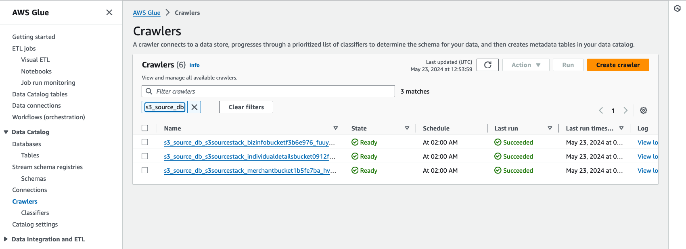

# Automated Datastore Discovery with AWS Glue

This sample shows you how to automate the discovery of various types of data sources in your AWS estate. Examples include - S3 Buckets, RDS databases, or DynamoDB tables. All the information is curated using [AWS Glue](https://aws.amazon.com/glue/) - specifically in its [Data Catalog](https://docs.aws.amazon.com/glue/latest/dg/catalog-and-crawler.html).

It also attempts to detect potential PII fields in the data sources via the [Sensitive Data Detection transform](https://docs.aws.amazon.com/glue/latest/dg/detect-PII.html) in AWS Glue.

This framework is useful to get a sense of all data sources in an organization's AWS estate - from a compliance standpoint. An example of that could be [GDPR Article 30](https://gdpr-text.com/read/article-30/).

There is an additional expectation (of GDPR Article 30) that information such as - "data subjects", "data consumers", "purpose of processing" etc. should be captured and reported. These attributes that can't be easily and automatically detected because it requires a lot of semantic context understanding of the data infrastructure and the actual data. Therefore, this solution expects that this information should be attached to the data resources (S3, RDS etc.) in the form of [resource tags](https://docs.aws.amazon.com/cdk/v2/guide/tagging.html).

In addition to Glue, this solution uses a combination of serverless AWS services like - [Amazon EventBridge](https://aws.amazon.com/eventbridge/), [AWS Lambda](https://aws.amazon.com/lambda/), [Amazon SQS](https://aws.amazon.com/sqs/), and [Amazon DynamoDB](https://aws.amazon.com/dynamodb/).

## System Architecture

### New Data Source Onboarding


When a new data source (S3, RDS, DynamoDB etc.) gets provisioned, there is an EventBridge rule that is listening on events in [AWS CloudTrail](https://docs.aws.amazon.com/awscloudtrail/latest/userguide/cloudtrail-user-guide.html). This rule triggers a Lambda function which pushes a message to an SQS Queue. A subsequent Lambda function gets invoked to make an entry in a DynamoDB table.

This DynamoDB table is used to manage the state of the different data sources with respect to their Glue configuration. In other words, it keeps track of whether the data source has had a data catalog entry as well as if a Glue ETL job has been configured to detect potential PII elements.

Note - the visual above shows the onboarding of a new S3 bucket as a datasource. The mechanism to onboard the other data sources is the same. It is slightly differen in the case of RDS databases because they themselves contain multiple tables. But that mechanism will be explained in a later section as well.

### Glue Data Catalog Initial Entry


Based on a cron schedule (achieved via an EventBridge rule), a Lambda function is triggered that queries the state management DynamoDB table to check which data sources do not have a Glue Data Catalog entry made. For each of the data sources that don't have a data catalog entry (captured by a boolean field), the Lambda function creates an entry in the Glue Data Catalog in the form of Tables and Crawlers.

The data crawlers are configured with a daily schedule. Once they finish running, they populate the data catalog table with the schema that was inferred as a result of crawling the data source.

### PII Glue Job Creation


Creation of the data catalog entry is one part of this framework. The other part is the creation of the PII detection Glue job(s) for the data sources.

The mechanism to have this automatically created is similar to the initial catalog entry. Based on a EventBridge cron schedule, a Lambda function is triggered that checks the state management DynamoDB table to see which sources have a data catalog entry but don't have the PII glue job configured. For the ones that don't have their Glue job configured, it goes ahead and creates a Workflow and an ETL job to detect PII elements in the data source.

### PII Detection


Once the necessary automated AWS Glue configuration is deployed, each data source has a PII detection glue job configured which runs on a schedule. After scanning the data, it would dump the findings (which data fields are potential PII) in a DynamoDB table. 

A lambda function would then periodically read from the PII detection output DynamoDB table and update the Data Catalog entry for that data source by marking the potential PII data fields as such.

### Tag Capture and reporting


Since data sources are expected to have the necessary tags, this information would just need to be extracted, curated and stored somewhere from where it could be examined or exported for further analysis. 

To achieve this, this solution features a periodically triggered Lambda function which queries the state management DynamoDB table to get a list of data sources, extract the metadata containing resource tags via API calls to the different services (S3, RDS, DynamoDB and so on), and then capture them in a separate DynamoDB table.

As a future enhancement, this information could be relayed back into the Glue Data Catalog as well (as depicted in the visual).

## Deploying the solution

This project is divided into a few sub-stacks, so deploying it also requires a few additional steps. It uses [AWS CDK](https://aws.amazon.com/cdk/) for [Infrastructure as Code (IaC)](https://en.wikipedia.org/wiki/Infrastructure_as_code). 

### Pre-requisites

* Since this is a [TypeScript](https://www.typescriptlang.org/) CDK project, you should have [npm](https://www.npmjs.com/) installed (which is the package manager for TypeScript/JavaScript).
    * You can find installation instructions for npm [here](https://docs.npmjs.com/downloading-and-installing-node-js-and-npm).

* Install [AWS CLI](https://aws.amazon.com/cli/) on your computer (*if not already done so*).
    *  `pip install awscli`. This means need to have python installed on your computer (if it is not already installed.)
    * You need to also configure and authenticate your AWS CLI to be able to interact with AWS programmatically. Detailed instructions of how you could do that are provided [here](https://docs.aws.amazon.com/cli/latest/userguide/cli-chap-configure.html)

### Install dependencies (if not already done)

```
npm install
```

### Bootstrap CDK environment (if not already done)

Bootstrapping provisions resources in your environment such as an Amazon Simple Storage Service (Amazon S3) bucket for storing files and AWS Identity and Access Management (IAM) roles that grant permissions needed to perform deployments. These resources get provisioned in an AWS CloudFormation stack, called the bootstrap stack. It is usually named CDKToolkit. Like any AWS CloudFormation stack, it will appear in the AWS CloudFormation console of your environment once it has been deployed. More details can be found [here](https://docs.aws.amazon.com/cdk/v2/guide/bootstrapping.html).

```
npx cdk bootstrap

# You can optionally specify `--profile` at the end of that command if you wish to not use the default AWS profile.
```

NOTE - you only need to do this once per account. If there are other CDK projects deployed in your AWS account, you won't need to do this.

### Deploy the base infrastructure

```
npx cdk deploy BaseInfraStack

# You can optionally specify `--profile` at the end of that command if you wish to not use the default AWS profile.
```

This will deploy the base infrastructure - consisting of a VPC, SQS Queues, EventBridge Rules, CloudTrail trail, Lambda functions. Most of these components serve to the automated detection of data source creation, and population into the state management DynamoDB table.

The CDK code for this is in the [lib](./lib) directory within the [base-infra-stack.ts](./lib/base-infra-stack.ts) file.

### Deploy the Glue Assets Stack

```
npx cdk deploy GlueAssetsStack

# You can optionally specify `--profile` at the end of that command if you wish to not use the default AWS profile.
```

This will deploy an S3 bucket that would contain assets required by Glue - such as the PII Detection ETL PySpark scripts, the temporary directory for Spark, and a directory for Spark History Logs.

It uses the [S3 Bucket Deployment](https://docs.aws.amazon.com/cdk/api/v2/docs/aws-cdk-lib.aws_s3_deployment.BucketDeployment.html) CDK construct to upload local resources to S3.

The Glue ETL scripts are located in the [scripts/glue](./scripts/glue/) directory in this repository. The CDK code for this is in the [lib](./lib) directory within the [glue-assets-stack.ts](./lib/glue-assets-stack.ts) file.

### Deploy the Glue Job creation Stack

```
npx cdk deploy GlueJobCreationStack

# You can optionally specify `--profile` at the end of that command if you wish to not use the default AWS profile.
```

This creates Glue Data Catalog databases for the different kinds of data sources, Lambda functions to create Glue jobs for the various databases as well as the ones to create the initial entry in the state management DynamoDB table.

The CDK code for this is in the [lib](./lib) directory within the [glue-job-creation-stack.ts](./lib/glue-job-creation-stack.ts) file.

### Deploy the Reporting Stack

```
npx cdk deploy ReportingStack

# You can optionally specify `--profile` at the end of that command if you wish to not use the default AWS profile.
```

This deploys Lambda function(s) to report potential PII columns back to the Glue Data catalog, and other ones to extract the tags from the data sources, and curate and store them in a Tag Reporting DynamoDB table.

The CDK code for this is in the [lib](./lib) directory within the [reporting-stack.ts](./lib/reporting-stack.ts) file.

### Deploy the S3 source Stack
```
npx cdk deploy S3SourceStack

# You can optionally specify `--profile` at the end of that command if you wish to not use the default AWS profile.
```

This will deploy 3 S3 Buckets with synthetic data (as csv files which are in the [synthetic-data](./synthetic-data/s3/)) directory. These buckets will serve as mock data sources for S3. The data is uploaded to these buckets via the S3 Bucket Deployment CDK construct.

The CDK code for this is in the [lib](./lib) directory within the [s3-source-stack.ts](./lib/s3-source-stack.ts) file.

#### Pause 
After having deployed this much of the solution, you can choose to simply go ahead to the [Testing and Validation](#seeing-the-solution-in-action) section. Because you have one type of data source (S3) ready with synthetic data and ready to be tested.

However, if you choose to deploy the entire solution before testing and validation, please proceed accordingly.

### Deploy the DynamoDB stack
```
npx cdk deploy DynamoDBStack

# You can optionally specify `--profile` at the end of that command if you wish to not use the default AWS profile.
```

This will deploy 2 DynamoDB tables which will serve to show how this solution can track DynamoDB data sources.

The CDK code for this is in the [lib](./lib) directory within the [dynamodb-stack.ts](./lib/dynamodb-stack.ts) file.

### Populate DynamoDB tables with Synthetic Data

There are 2 Python Scripts in the [scripts/ddb_synthetic_data_generation](./scripts/ddb_synthetic_data_generation/) directory of this project that will populate the 2 DynamoDB tables that were created as part of deploying the DynamoDB stack.

```
# navigate to the correct directory
cd ./scripts/ddb_synthetic_data_generation

# create a python virtual environment (recommended)
python3 -m virtualenv .venv

# activate the virtual environment
source .venv/bin/activate

# run the first script to populate the "individual details" DynamoDB table
python synthetic_individual_details_ddb.py 

# run the first script to populate the "network info" DynamoDB table
python synthetic_network_info_ddb.py 
```

NOTE - 
* If you are running the scripts via a non default AWS profile, you can specify it via the `--aws-profile` flag on the script, followed by the profile name itself.

* If you are want to use the AWS environment variables for authorizing API calls, then you can specify the `--env` flag.

* By default, it will insert 1000 records in the table. To modify this number, you can specify it via the `--max-records` flag in the script.

Help menu:
```
python synthetic_individual_details_ddb.py --help
usage: synthetic_individual_details_ddb.py [-h] [-e] [-p AWS_PROFILE] [-r AWS_REGION] [-m MAX_RECORDS] [-v]

synthetic-data-gen-ddb

options:
  -h, --help            show this help message and exit
  -e, --env             Use environment variables for AWS credentials
  -p AWS_PROFILE, --aws-profile AWS_PROFILE
                        AWS profile to be used for the API calls
  -r AWS_REGION, --aws-region AWS_REGION
                        AWS region for API calls
  -m MAX_RECORDS, --max-records MAX_RECORDS
                        Maximum records to be inserted
  -v, --verbose         debug log output
```

After successfully running the 2 scripts, the 2 DynamoDB tables will have synthetic data. You can go and verify this in the console.

### Deploy the RDS Stack 
```
npx cdk deploy RDSStack

# You can optionally specify `--profile` at the end of that command if you wish to not use the default AWS profile.
```

This will deploy an Aurora Serverless V1 (PostgreSQL) database cluster. Additionally, it deploys the security group for the database. 

Lastly, it also creates the Glue Data Catalog database for RDS. The reason to do so is that the glue initialization setup is slightly different for an RDS database because each database needs a JDBC connection for their crawlers. Each database can have multiple tables. 

The CDK code for this is in the [lib](./lib) directory within the [rds-stack.ts](./lib/rds-stack.ts) file.

### Deploy the RDS DDL Source Stack 
```
npx cdk deploy DDLSourceStack

# You can optionally specify `--profile` at the end of that command if you wish to not use the default AWS profile.
```

This will deploy an S3 bucket which would contain the DDL (intialization SQL) for the RDS database. It will do so by utilizing the S3 Bucket Deployment CDK construct.

The DDL / Initialization SQL [script](./scripts/rds-ddl-sql/rds-ddl.sql) is in the [scripts/rds-ddl-sql](./scripts/rds-ddl-sql/) directory of this repository.

The CDK code for this is in the [lib](./lib) directory within the [rds-ddl-source-stack.ts](./lib/rds-ddl-source-stack.ts) file.

### Deploy the DDL Deployment Stack
```
npx cdk deploy DeployDDLStack

# You can optionally specify `--profile` at the end of that command if you wish to not use the default AWS profile.
```
This will deploy the Lambda function(s) that apply the initialization SQL (mentioned in the [DDL SQL Script](./scripts/rds-ddl-sql/rds-ddl.sql)) when the RDS / Aurora database first comes online; as well as whenever there is a change in the DDL SQL Script.

The CDK code for this is in the [lib](./lib) directory within the [ddl-deployment-stack.ts](./lib/ddl-deployment-stack.ts) file.

After this stack is deployed you can actually go into the RDS console and Query this database and verify that the DDL SQL has been applied to the database.

This method / pattern of initializing RDS databases is inspired by another [Open Source Sample](https://github.com/aws-samples/ddl-deployment-for-amazon-rds).

### Deploy the RDS Glue Initializer Stack
```
npx cdk deploy RDSGlueInitStack

# You can optionally specify `--profile` at the end of that command if you wish to not use the default AWS profile.
```
This will deploy the Lambda function that creates the JDBC connection and the Glue Crawler for the RDS database(s)

The CDK code for this is in the [lib](./lib) directory within the [rds-glue-data-catalog-init-stack.ts](./lib/rds-glue-data-catalog-init-stack.ts) file.

### Deploy the RDS Glue Data Catalog Tracker Stack
```
npx cdk deploy RDSGlueTrackerStack

# You can optionally specify `--profile` at the end of that command if you wish to not use the default AWS profile.
```
This will deploy the Lambda function that will create an initial entry in the state management DynamoDB table; and an EventBridge rule that gets triggered when there is a "CreateTable" event emitted by AWS Glue (captured in CloudTrail).

This is the difference of the RDS setup. The state management data catalog tracking is done after the JDBC connection and crawler is created. When the crawler is actually run (and if it ends up detecting tables in the database), it will create the entry in the state management DynamoDB table. Depicted below:


The CDK code for this is in the [lib](./lib) directory within the [rds-glue-data-catalog-tracking-stack.ts](./lib/rds-glue-data-catalog-tracking-stack.ts) file.

## Seeing the solution in action

Whilst the solution that is deployed is completely automated, and requires no manual human intervention, there might be an inclination to test and validate this immediately. 

This section will cover how to test and validate this solution.

### Validating the S3 Data Source Setup

* Log into the AWS console, and navigate to DynamoDB.
* Search for the "glueJobTracker" table. This is the state management table. This keeps track of all the different data sources with regards to their AWS Glue configuration. 
* If you click on "Explore items" on this table, you should see some records already populated. You can try to filter for the ones where the field "data_catalog_db_name" is "s3_source_db". 
* This should show you 3 S3 data sources at least where the fields "data_catalog_entry" and "glue_job_created", and they should be set to "false".
    * If you do nothing, the automation mechanism should take care of creating both catalog entries as well as the ETL job for these data sources. But this guide will show you on how to manually run the scheduled lambda functions to help validate the solution.
* Navigate to the AWS Lambda console, and search for "s3GlueCatalogCreator", and click into the function that shows up.
* There is a button to "Test" the function, click it. You may need to create an event, just create any random event.
    * It should finish running in a couple of minutes, and then the log messages should have texts like "Successfully created crawler", "Successfully created data catalog table", and "Successfully updated DynamoDB item"
    * If you refer back to the state management DynamoDB table, you can see the s3 data sources should now have the "data_catalog_entry" field set to "true" now.
* To verify that the lambda function that you ran manually, navigate to the AWS Glue console.
* On the left hand side, under Data Catalog, select the Crawlers option, and you will see a page with all the crawlers.
* Search for "s3_source_db" in the search bar, and it should filter all the relevant Crawlers (as shown below):

* Select all 3 crawlers, and then select Run. It should take a few minutes. The crawlers will inspect the relevant S3 Source Data Buckets (where the csv files containing synthetic data were uploaded), and infer the schema.
* Once they finish running, the "Last run" column will have "Succeeded", and you would be able to verify that by looking at the "Last run timestamp" column in that view.
* On the left hand pane, under Data Catalog, select Databases, and select "s3_source_db", and you should be able to see 3 tables under that table, and if you click into either one, they should show you the schema (as shown below):

* Now go back into the Lambda console, and search for "s3GlueCreator", and click into the function, and run the function via the "Test" button as you did for the previous function.
    * It will take a few minutes to finish execution, and you should see log messages like "Successfully created glue job", "Successfully created glue workflow", and "Successfully created glue trigger".
    * The state management DynamoDB table's entry should have "glue_job_created" set to "true" now.
* If you go back to the Glue console, and select "ETL Jobs" on the left pane, and filter by entering "s3-pii-detect" in the search bar (as shown below):

* Select any one of them and select "Run job". It should take about 5-10 minutes to finish running.
* After you verify that the job ran successfully, you can go into the DynamoDB console, search for the "piiDetectionOutput" table, and if you "explore table items", it should show you some entries.
* To have these reflected back into the data catalog table, navigate to the Lambda console, and search for "PIIReportS3", and select the function, and test it as done for previous functions.
    * After successful execution, you should see log messages like "Fetching PII elements from table: ..", "Successfully update Glue Data Catalog Table". 
* To verify this, navigate back to the Glue console, and navigate to the Tables under "Data Catalog" on the left pane. Filter by typing "s3_source_db" in the search bar.
* Click into any table, and under schema you should see the Comment section updated for all the columns potentially identified as PII (as seen below)

* To validate that the tags are reported as well, you can trigger the Tag reporting Lambda function by searching for "tagReportS3" in the Lambda functions console, and invoke it manually.
* Once it successfully updates, you can verify that the "tagCaptureTable" in DynamoDB has the entries from the S3 data sources.

### Validate the DynamoDB Data Source Setup

For the DynamoDB sources, the way to validate & test is the same as the S3 Data sources. The only differences are:
* The AWS Glue Data Catalog Database name is "ddb_source_db" instead of "s3_source_db".
* And whilst searching for the Lambda functions replace the term "s3" with "ddb".
* The Glue ETL jobs are named with the prefix "dynamodb-pii-detect", so you can use that to filter the glue jobs.

### Validate the RDS Data Source Setup

The validation steps for RDS data sources is slightly different (from S3 and DynamoDB) because it requires a creation of JDBC connection, and crawlers based on different schemas within the database.

If you've deployed all the infrastructure stacks pertaining to RDS, then follow the steps below to validate the setup for the RDS (Aurora) data source 

* Lets first verify the JDBC Connection which is created:
    * Navigate to AWS Glue console, and select the "Data connections" on the left pane, and you should be able to find a connection object named something like "glue-connection-rdsstack-rdssource" - click into it, under the Actions drill down select "Test Connection".
    
    * On the pop-up, it will ask you to select an IAM role, so select the one which is named like "BaseInfraStack-glueETLRole", and then select confirm. It will take a few minutes to run, but it should be successful.

* Lets run the crawler that was configured and created when the RDS database was first provisioned:
    * Go to the Crawlers section under the Glue Data Catalog on the left pane, and filter the crawlers by entering "glue-crawler-rds". Select it and hit Run.
    

* After the crawler finishes running, it should create 2 tables at least (given that the database was initialized as instructed in the deployment instructions). Navigate to "Databases" under Data Catalog in the Glue Console, and filter by "rds_source_db". Select that database, and you should see at least 2 tables as shown below:


* Next we need to verify if these entries made it to the state management DynamoDB table. So go to the "glueJobTracker" DynamoDB table and explore table items. Filter the items by the "data_source_type" to be "rds". 
    * At least 2 items should be there, and the "data_catalog_entry" for these should be set to "true", but "glue_job_created" should be set to "false"

* Go to the Lambda console, and search for "rdsGlueCreator", click into it. Invoke it manually as you've done for the other data sources. Successful execution logs will include messages like "Successfully created glue job", "Successfully created glue workflow", "Successfully glue trigger", and "Successfully updated DynamoDB item."
    * You can go back to the state management DynamoDB table and notice the "glue_job_created" flag would be set to "true" for the rds data sources.

* The rest of the validation steps from here on out are the same as the ones from S3 and DynamoDB sources.
    * Go to the AWS Glue console, and navigate to ETL jobs and filter by "rds-pii-detect".
    
    * Select any one of them and select Run job. It should take about 5 minutes to complete successfully running.
    * You can navigate to the "piiDetectionOutput" DynamoDB table to verify the entries from this glue job.
    * Now navigate to the Lambda console, search for "PIIReportRDS", and click into the function. Manually invoke it.
    * After it finishes you can navigate to the Glue Data Catalog, under the "rds_source_db", select the table for which you ran the Glue job, and it should show up in the comment section for the columns identified as sensitive data element as shown below:
    

* For the tag reporting step, follow the same process as was described in the S3 validation section. Search for the "tagReportRDS" in the lambda console, and invoke the function manually. After successful execution, it should populate the "tagCaptureTable" in DynamoDB accordingly.

## Future enhancements / improvements

* Currently, this solution is limited to S3, DynamoDB and RDS. It can be extended to other data sources like Redshift, DocumentDB, Keyspaces etc. using the patterns established already in this solution.

* Data cleanup - periodically cleanse the output tables capturing tag information and PII information to keep the data size reasonable.

* Dead Letter Queue (DLQ) for all the Lambda functions to capture failures in execution, and appropriately remediate.

* Fine tune EventBridge rules. Currently they are relatively broad, and there is logic in the Lambda function(s) to make sure only the right events are actioned upon.

* Create a common python library and/or layer that is used across different Lambda functions to reduce duplicate code across functions.


## Generic CDK instructions

This is a blank project for CDK development with TypeScript.

The `cdk.json` file tells the CDK Toolkit how to execute your app.

## Useful commands

* `npm run build`   compile typescript to js
* `npm run watch`   watch for changes and compile
* `npm run test`    perform the jest unit tests
* `npx cdk deploy`  deploy this stack to your default AWS account/region
* `npx cdk diff`    compare deployed stack with current state
* `npx cdk synth`   emits the synthesized CloudFormation template
